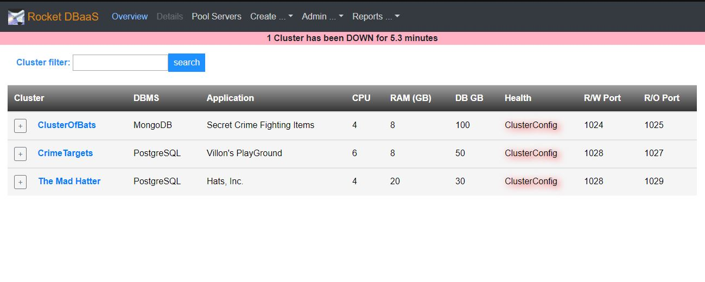
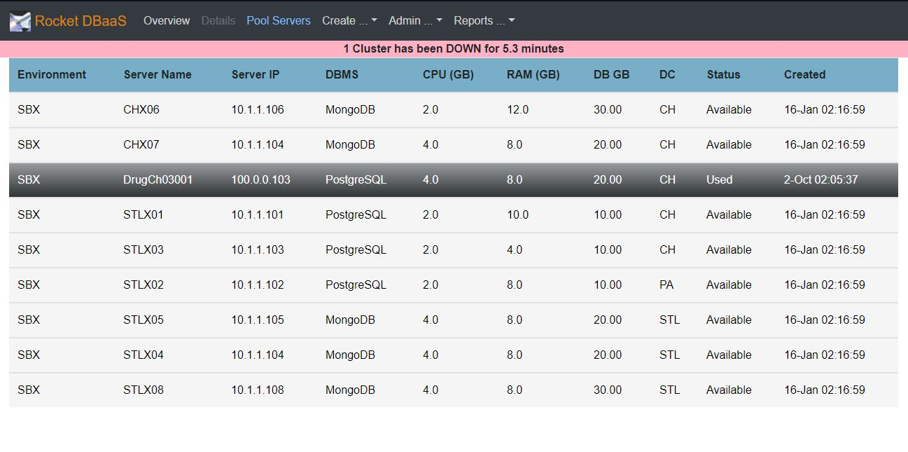

<h1>RocketDBaaS Images</h4>

<h2>Clusters and Servers overview</h2>

.JPG)

<h2>Clusters Details</h2>

.JPG)

.JPG)

.JPG)

.JPG)

.JPG)

.JPG)

.JPG)

<h2>Pool Servers</h2>

<h2>Create Cluster</h2>

.JPG)

<h2>Admin screens</h2>

.JPG)

.JPG)

